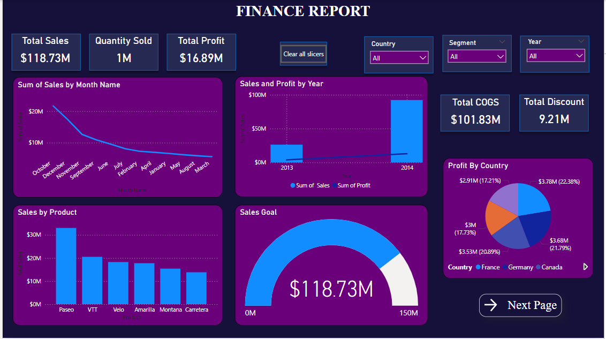

# Power BI Sales Analysis Report

## Overview

This Power BI project provides an in-depth analysis of sales data across multiple dimensions such as country, segment, and year. The report is divided into three pages, each offering unique insights through a variety of visualizations and interactive elements.
### Dashboard Page

### Segment Wise Report

### Country Wise Report

## Pages and Features

### 1. Dashboard

- **Slicers**: Country, Segment, Year
- **Cards**: Total Sales, Quantity Sold, Profit, Cost of Goods Sold (COGS), Discount
- **Visualizations**:
  - Line Chart: Sales by Month
  - Bar Chart: Sales by Year
  - Bar Chart: Sales by Product
  - Gauge: Sales Goal Achievement (Target: 150M)
  - Pie Chart: Profit by Country
- **Tooltips**: Interactive bar charts for Quantity Sold and Total Profit when hovering over cards, enabled with cross-page report settings.

### 2. Segment Wise Report

- **Slicer**: Year
- **Visualizations**:
  - Pie Chart: Profit by Segment
  - Bar Chart: Sales by Segment
  - Table: Segment, Sales, Profit, Gross Sales

### 3. Country Wise Report

- **Slicers**: Year, Country
- **Visualizations**:
  - Gauge: Sales required to meet the country's goal
  - World Map: Sales by Country
  - Line Chart: Sales and Profit by Country
  - Table: Country, Sales, Profit, Gross Sales

## Features and Interactivity

- **Dynamic Slicers**: Allow for real-time data filtering across different dimensions (Country, Segment, Year).
- **Tooltips and Cross-Page Filtering**: Enhances user experience by providing additional insights and quick access to detailed visualizations.
- **Visual Diversity**: Includes a mix of line charts, bar charts, pie charts, gauges, and maps for comprehensive data representation.

## Usage

To view this Power BI report, download the .pbix file from the repository and open it in Power BI Desktop. Use the slicers and interactive elements to explore the data.

## Author

Created by Joel Joshi

## Last Updated

August 27, 2024
